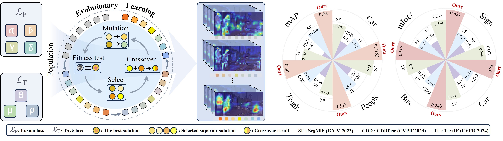
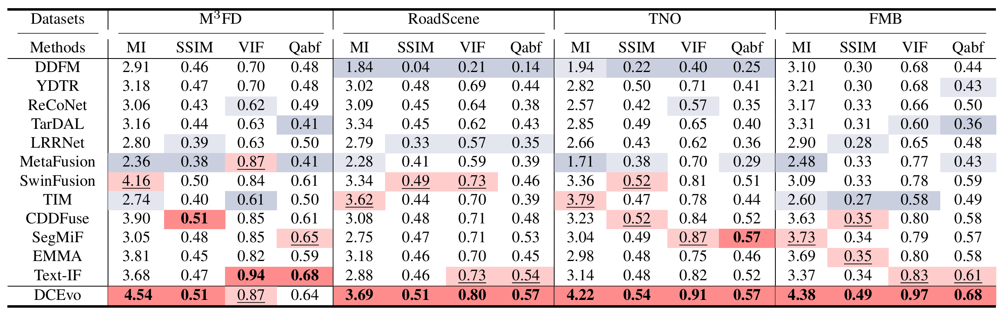
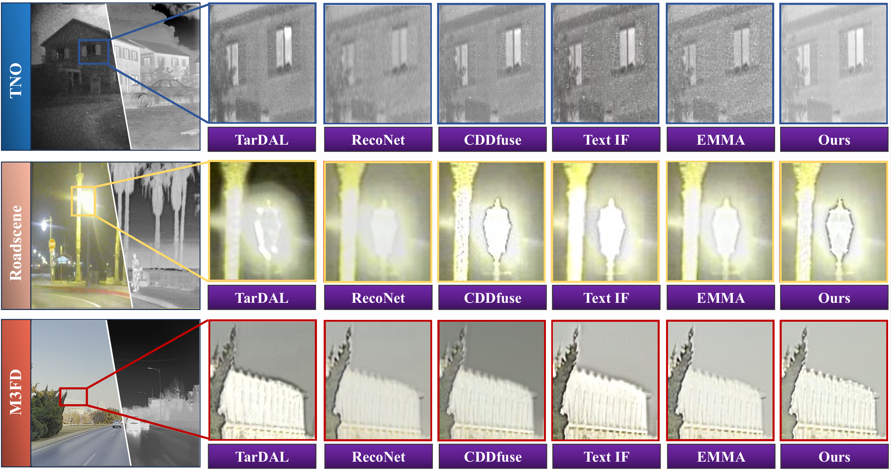
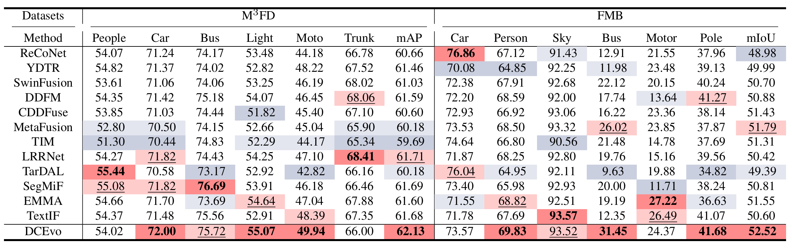
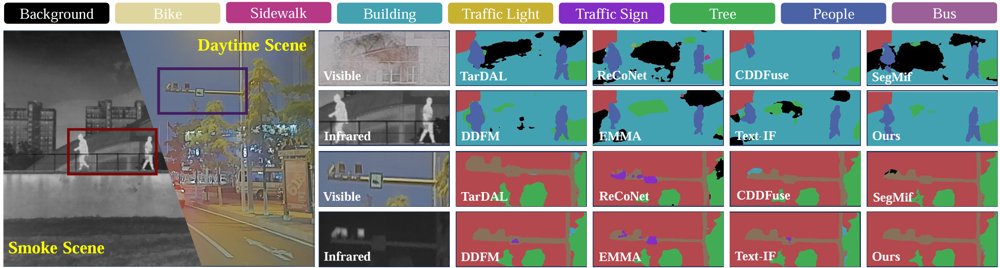

# DCEvo

Jinyuan Liu, Bowei Zhang, Qingyun Mei, Xingyuan Li, Yang Zou, Zhiying Jiang, Long Ma, Risheng Liu, Xin Fan, **"DCEvo: Discriminative Cross-Dimensional Evolutionary Learning for Infrared and Visible Image Fusion"**,
IEEE/CVF Conference on Computer Vision and Pattern Recognition **(CVPR)**, 2025.




## Updates
[2025-03-26] Our paper is available on CVPR open access! [[CVPR Version](https://openaccess.thecvf.com/content/CVPR2025/html/Liu_DCEvo_Discriminative_Cross-Dimensional_Evolutionary_Learning_for_Infrared_and_Visible_Image_CVPR_2025_paper.html)]  
[2025-03-26] Our paper is available online! [[arXiv Version](https://arxiv.org/abs/2503.17673)]  
[2025-03-26] The Chinese translation is available! [[中译版本](./pdf/CN_paper.pdf)]   


## Environment
```
# create virtual environment
conda create -n DCEvo python=3.9
conda activate DCEvo
# install requirements
pip install -r requirements.txt
```


## Datasets Preparation
We provide a demo dataset in **"DCEvo/datasets"**.

We test image fusion according to full datasets in the [[IVIF ZOO Project](https://github.com/RollingPlain/IVIF_ZOO/)].  


## Test Image Fusion  
Our checkpoints can be found in **"DCEvo/ckpt"**. Then, you can test our pure fusion method through
```
python test_Fusion.py
```


## Color Gray Images  
You can color the output gray images for task-guided image fusion training and testing through
```
python tocolor.py
```


## Fusion Results
1. Quantitative comparison of infrared and visible image fusion between our DCEvo and state-of-the-art methods on M3FD, RoadScene, TNO and FMB datasets.


2. Qualitative comparisons of our DCEvo and existing image fusion methods. From top to bottom: low-light in TNO, high-brightness in RoadScene and low-quality in M3FD..



## Test Task-Guided Image Fusion  
Testing this pipeline needs to generate **RGB Pure Fusion** images in **"DCEvo/datasets/M3FD/images"**.
You can test our task-guided fusion method through
```
python test_task_guided_fusion.py
```


## Results of Task-Driven Downstream IVIF Applications
1. Quantitative comparison of our DCEvo and existing image fusion methods for downstream detection and segmentation tasks on the M3FD, and FMB datasets.


2. Qualitative comparison task of our method and existing infrared and visible image fusion methods in downstream object detection on the M3FD dataset. The objects in our fusion images are fully detected.


3. Qualitative comparison of our DCEvo with the fusion images generated by different fusion methods on the FMB dataset. Our approach performs the best segmentation results in the smock scene and daytime scene.



## Train Task-Guided Image Fusion  
Training this pipeline needs to generate **RGB Pure Fusion** images in **"DCEvo/datasets/M3FD/train/images"**.
You can train our task-guided fusion method through
```
python DCEvo_train.py
```


## Citation
```
@InProceedings{Liu_2025_CVPR,
    author    = {Liu, Jinyuan and Zhang, Bowei and Mei, Qingyun and Li, Xingyuan and Zou, Yang and Jiang, Zhiying and Ma, Long and Liu, Risheng and Fan, Xin},
    title     = {DCEvo: Discriminative Cross-Dimensional Evolutionary Learning for Infrared and Visible Image Fusion},
    booktitle = {Proceedings of the Computer Vision and Pattern Recognition Conference (CVPR)},
    month     = {June},
    year      = {2025},
    pages     = {2226-2235}
}
```
